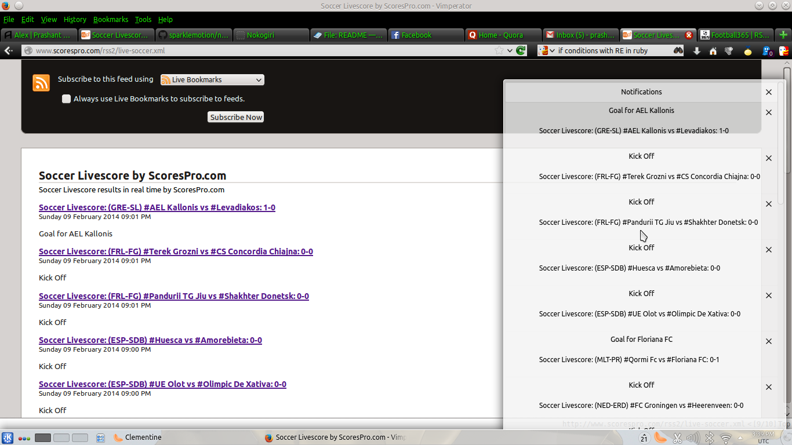

Footy
--------------------

This is an Ruby script written by me to simply receive notifications as and when a goal is scored, or a game starts, ends, or half time etc. 

Tested on Ubuntu - Unity and KDE. 

Dependencies
-------------------
Gems

- nokogiri
- open-uri
- libnotify

Packages to be installed from apt-get

- libinotify-ruby 
- libgtk2-ruby 
- libnotify-dev

Run it
---------------
- Clone this application and cd. 
- Simply
        
            $ ruby noko.rb

Screenshot
-----------------

Issues
---------------
Lots of bugs are there, even I know. Feel free to suggest changes! At present, I plan to right a command line gem. 

License
-----------------
This work is licensed under WTFPL.

Copyright (C) 2014 , Prashant Anantharaman
